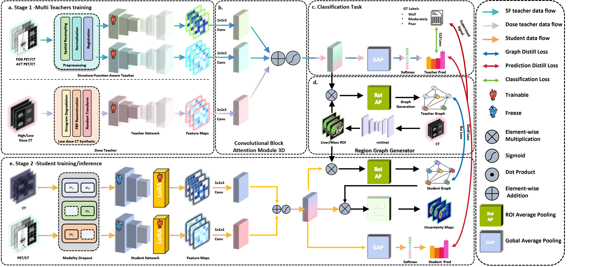
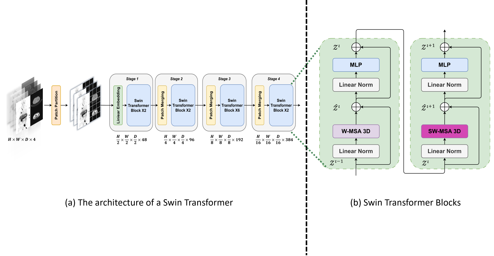
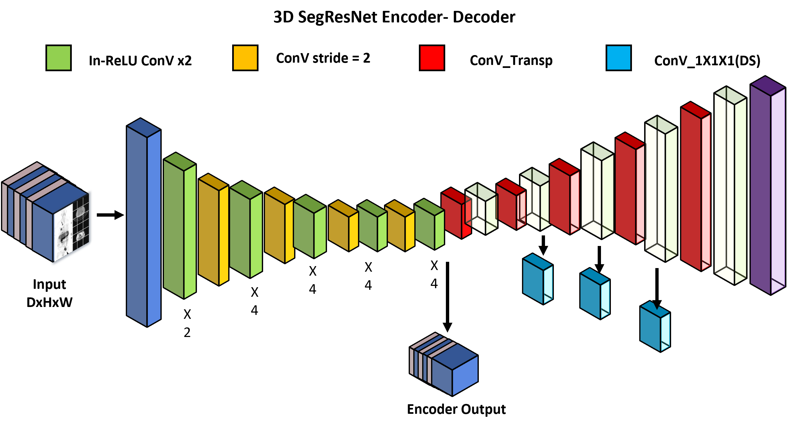

# REACT-KD
Region-Aware Cross-modal Topological Knowledge Distillation for Interpretable Medical Image Classification

## 📌 Pipeline Overview

*The current pipeline reflects our initial implementation. LoRA-based components are excluded due to space limitations. A LoRA-enabled student model is provided for reference, and future work will explore LoRA-C for robust CNN vs Transformer adaptation.*
## 🧠 Teacher Model

## 🎯 Student Model

## 📚 Dataset Description

To enable multi-modal knowledge distillation and external validation in hepatocellular carcinoma (HCC) tumor grade classification, we utilized a diverse dataset composed of:

### 🏥 1. Hospital HCC Cohort (Private)
- **Source:** In house-HK SAR population
- **Period:** January 2004 – December 2024  
- **Patients:** 97 HCC patients  
- **Imaging:** 194 dual-tracer PET/CT scan pairs  
  - PET tracers: ¹⁸F-FDG and ¹¹C-Acetate  
  - Co-registered PET + CT volumes (`512 × 512 × 148`)  
- **Labels:**  
  - Tumor Pathology grade (Edmondson–Steiner classification: 3 classes(Well differentiated, Moderately differentiated, Poorly differentiated))
  - Clinical metadata: AFP, age, sex, hepatitis status

---

### 📊 2. LiTS17 Benchmark (Public)
- **Source:** LiTS 2017 Challenge  
- **Scans:** 131 contrast-enhanced abdominal CT volumes  
- **Annotations:** Liver and tumor segmentation masks  
- **Usage:** Encoder-level pretraining and topological graph construction  
- **Resolution:**  
  - Slice range: 42–1026 slices  
  - In-plane spacing: 0.56–1.0 mm  

---

### 🧪 3. HCC-TACE-Seg Dataset (Public)
- **Scans:** 105 multiphasic contrast-enhanced CT scans  
- **Annotations:** Expert segmentation + histopathological tumor grade (3 classes: Well differentiated, Moderately differentiated, Poorly differentiated)
- **Context:** Real-world TACE treatment under standard imaging protocols  
- **Usage:** External validation only

---

### 🔄 Dataset Usage Summary

| Dataset            | Role                  | Modality      | Grade Label | Notes                              |
|--------------------|-----------------------|---------------|-------------|-------------------------------------|
| HKSH PET/CT (priv) | Teacher training      | PET + CT      | ✅ Yes      | Main supervised distillation source |
| LiTS17             | Teacher training      | CT only       | ❌ No       | Used for segmentation + graph prep  |
| HCC-TACE-Seg       | External validation   | CT only       | ✅ Yes      | No training, validation only        |
